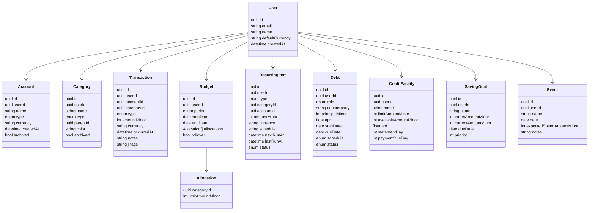

# Domain model

The system revolves around financial events recorded by users, categorized for analysis and planning.

## Entities

- User
  - id, email, name, defaultCurrency, createdAt
- Account
  - id, userId, name, type (cash|bank|card|investment), currency, createdAt, archived
- Category
  - id, userId, name, type (income|expense), parentId?, color?, archived
- Transaction
  - id, userId, accountId, categoryId?, type (income|expense|transfer), amount, currency, occurredAt, notes?, tags[]
  - For transfer: fromAccountId, toAccountId, feeAmount?
- Budget
  - id, userId, period (monthly|weekly|custom), startDate, endDate, allocations[{categoryId, limitAmount}], rollover (bool)
- RecurringItem
  - id, userId, type (income|expense), categoryId, accountId, amount, currency, schedule (cron or RRULE), nextRunAt, lastRunAt, status
- Debt
  - id, userId, role (lent|borrowed), counterparty, principal, interestRateAPR, startDate, dueDate?, schedule (monthly|custom), status
  - payments[]: {id, amount, occurredAt, interestPortion, principalPortion}
- CreditFacility
  - id, userId, name, limitAmount, availableAmount, apr, statementDay, paymentDueDay
- SavingGoal
  - id, userId, name, targetAmount, currentAmount, dueDate?, priority
- Event
  - id, userId, name, date, expectedSpendAmount?, notes?

## Relationships
- User 1..* Account
- User 1..* Category
- User 1..* Transaction
- User 1..* Budget
- User 1..* RecurringItem
- User 1..* Debt
- User 1..* CreditFacility
- User 1..* SavingGoal
- User 1..* Event

## Invariants and notes
- All monetary values are stored in minor units (e.g., cents) to avoid FP errors.
- Currency on `Transaction` must match `Account.currency` unless a conversion step is introduced.
- `Transaction.categoryId` is optional for transfers.
- `Budget.allocations` categories must be `type=expense`.
- `RecurringItem` generation is idempotent per period.

## Diagram

